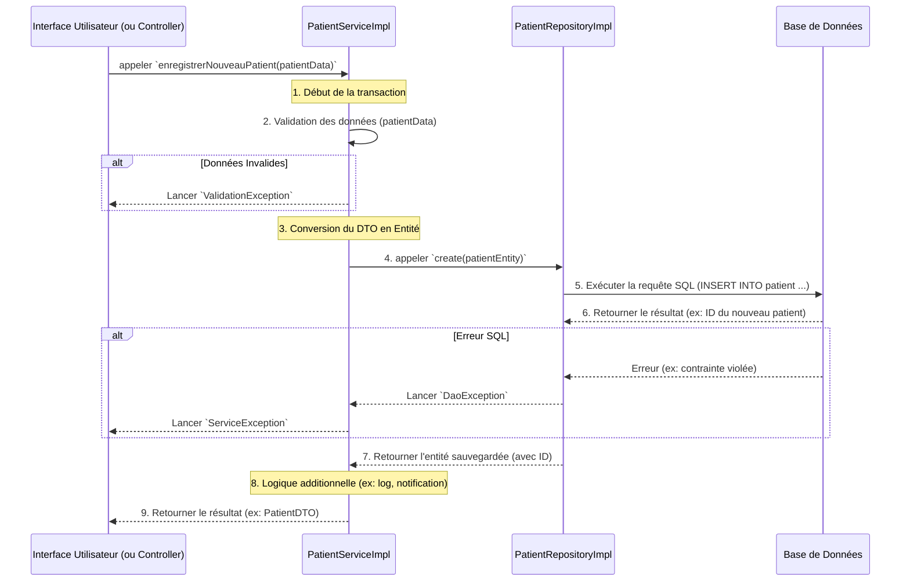

# Flux de Fonctionnement d'un Service : Exemple avec `PatientService`

Le flux peut être décomposé en plusieurs étapes claires, depuis l'interface utilisateur jusqu'à la base de données.

### Explication des Étapes :

1.  **Appel Initial (Couche de Présentation)**
    *   Tout commence par une action de l'utilisateur, par exemple, remplir un formulaire et cliquer sur "Enregistrer".
    *   Le **Controller** (ou la vue) collecte les données du formulaire et appelle la méthode correspondante du service : `patientService.enregistrerNouveauPatient(donneesDuFormulaire)`.

2.  **Validation (Dans le Service)**
    *   La première chose que fait le service est de **valider les données** reçues.
    *   Il vérifie si les champs obligatoires sont présents (nom, prénom), si les formats sont corrects (email), et si les règles métier sont respectées (par exemple, l'adresse email ne doit pas déjà exister).
    *   Si la validation échoue, le service lève une `ValidationException` avec un message clair. Cette exception est "attrapée" par le controller, qui affiche un message d'erreur à l'utilisateur.

3.  **Préparation des Données**
    *   Si la validation réussit, le service convertit l'objet de transfert de données (DTO - `PatientDTO`) en une entité de base de données (`Patient`). C'est l'entité qui sera mappée aux colonnes de la table.

4.  **Interaction avec le Repository**
    *   Le service ne parle jamais directement à la base de données. Il délègue cette tâche au **Repository**.
    *   Il appelle la méthode `patientRepository.create(patientEntity)`.

5.  **Exécution de la Requête (Dans le Repository)**
    *   Le `PatientRepositoryImpl` contient le code JDBC (ou JPA/Hibernate) nécessaire.
    *   Il génère une requête SQL `INSERT INTO patient ...` à partir de l'objet `patientEntity`.
    *   Il exécute cette requête sur la base de données.

6.  **Opération en Base de Données**
    *   La base de données insère la nouvelle ligne dans la table `patient`. Si l'opération réussit, elle peut retourner l'ID auto-généré.
    *   En cas de problème (ex: violation d'une clé étrangère), la base de données retourne une erreur SQL.

7.  **Retour au Service**
    *   Le repository "attrape" une éventuelle `SQLException` et l'encapsule dans une `DaoException` (une exception propre à la couche d'accès aux données) avant de la relancer.
    *   Si tout s'est bien passé, le repository retourne l'entité sauvegardée (maintenant avec un ID) au service.

8.  **Logique Finale (Dans le Service)**
    *   Le service peut maintenant effectuer des tâches supplémentaires, comme enregistrer un log ("Le patient X a été créé") ou créer une notification pour les administrateurs.
    *   S'il a reçu une `DaoException`, il peut la "traduire" en une `ServiceException` plus générale avant de la relancer.

9.  **Réponse à l'UI**
    *   Finalement, le service retourne un DTO du patient nouvellement créé au controller.
    *   Le controller utilise ce DTO pour mettre à jour l'interface utilisateur, par exemple en affichant un message de succès et en redirigeant l'utilisateur vers la liste des patients.

Ce flux garantit une **séparation claire des responsabilités** :

*   Le **Controller** gère les interactions avec l'utilisateur.
*   Le **Service** orchestre la logique métier et la validation.
*   Le **Repository** gère la communication avec la base de données.
*   

